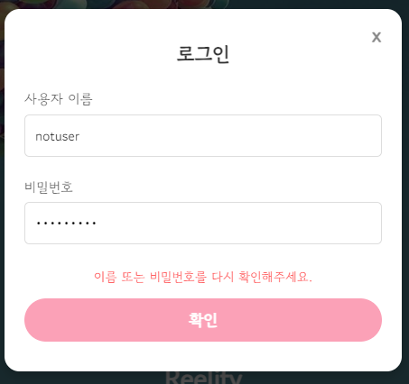

# Reelify


## 💡 프로젝트 소개

### ⚙ 개요

- 진행 기간 : 2024/11/18 ~ 2024/11/26
- 소개 : 영화 정보 제공 및 커뮤니티 서비스
  

### ⚙ 개발 환경 및 기술

  
 


  

  


### ⚙ 팀 구성

|       |  Github  |  역할  |
|:------------:|:------------:|:------------:|
| **김시아** (조장)  |  [thesiakim](https://github.com/thesiakim)  |  Backend, Frontend  |
| **강은수** |  [eeunxxu](https://github.com/eeunxxu)  |  AI, Frontend  |

<br>

### ⚙ API 명세서

https://documenter.getpostman.com/view/26669867/2sAYBVgWfp

<br>

## 🧬 서비스 소개

### ⚙ 기획

- TMDB API를 통해 영화와 관련된 정보(줄거리, 배우, 감독, 동영상)를 제공
- 개인별 맞춤 영화 추천 서비스 제공
- 영화 리뷰를 기반으로 한 커뮤니티 서비스 제공 
<br>

### ⚙ ERD


- Movie 테이블을 중심으로 Actor, Genre, Director, Country, Provider는 다대다 관계이며 Video는 일대다 관계
- Comment 테이블에는 parent_commend_id를 지정하여 댓글-대댓글을 위한 계층 구조 설정
<br>

### ⚙ Components Map


<br>

### ⚙ 회원가입


- dj-rest-auth가 제공하는 이메일 인증 프로세스 활용
- 회원가입 시 이메일 주소 및 선택한 영화 정보를 포함할 수 있도록 CustomRegisterSerializer 업데이트
- 인증번호는 최대 5분간 유효하도록 지정했으며, 시간을 초과한 경우 재인증 요청 메시지 출력

<br>


- 개인별 맞춤 영화 추천 알고리즘을 위한 데이터 수집
- 사용자가 선택한 장르를 기반으로 인기 영화(TMDB API의 popularity 기준) 중 일부를 랜덤으로 제공
- 동일한 요청에 대해 Django 캐싱을 사용하여 쿼리 비용 절감 (1시간 유효)

<br>

### ⚙ 로그인




- 존재하지 않는 username 또는 password가 틀렸을 경우 에러 메시지 출력

<br>

### ⚙ 자동 완성 검색 및 필터링


- Lodash의 debounce를 활용하여 과도한 API 호출 방지 (200ms 적용)
- 키보드 탐색 및 마우스 클릭으로 검색어을 선택하여 UX 향상  

<br>


- 중복 조회를 제공하여 다양한 영화 필터링 가능
- 필터링된 영화에 대하여 개봉일, 리뷰 수, 추천 수, 인기(TMDB API의 popularity)순으로 정렬 제공

<br>

### ⚙ 내 주변 영화관 찾기


- KAKAO MAP API를 활용하여 현재 내 위치를 인식하고 주변 영화관을 마커로 표시
- 마커 클릭 시 간단한 정보 확인 가능 (이름, 주소, 전화번호, 상영시간표 링크)
- 상영 시간표 클릭 시 해당 영화관의 네이버 상영 시간표 검색 페이지로 이동
- 동적 지도 업데이트 : 지도를 드래그하거나 줌을 조정하는 사용자의 이벤트에 실시간으로 반응하여 새로운 중심 위치를 기준으로 영화관 데이터를 다시 검색하고 마커 갱신

<br>

### ⚙ 박스 오피스 순위


- 영화 제목, 순위, 포스터 이미지를 얻기 위해 TMDB API와 영화진흥위원회 API를 결합
- 영화 제목에 특수문자가 있는 경우 제거한 뒤 개봉일과 가장 근접한 영화 데이터 필터링 
- 동일한 요청에 대해 Django 캐싱을 사용하여 동일 요청 시 API 호출 최소화 (8시간 유효)


<br>


### ⚙ 영화 상세 페이지


- 상세 페이지에서 제공하는 모든 데이터는 TMDB API를 활용
- 영화 제목, 원제, 개봉일, 장르, 국가, 상영 시간, 감상 가능 OTT, 포스터, 줄거리, 태그라인, 감독, 배우 정보 제공

<br>


- 회원가입한 사용자의 경우 영화에 추천 가능
- 추천 및 추천 취소가 가능한 토글 버튼을 통해 값을 변경할 때마다 동적으로 아이콘 변경 

<br>


- Vue의 Chart.js를 통해 사용자들이 리뷰 작성 시 평가한 rating의 분포도를 그래프로 표현 
- 가장 높은 분포에 해당하는 별점 강조 

<br>


- 리뷰 전체의 평균값과 함께 추천이 높은 순으로 다섯 개의 리뷰 노출 

<br>


- 동영상 썸네일 클릭 시 모달로 바로 재생 가능

<br>

  
- 배우 및 감독 사진 클릭 시 모달로 영화 정보 확인 가능

<br>

### ⚙ 커뮤니티

  
- 마우스 오버를 통해 사용자가 선택하는 rating을 실시간으로 감지
- 글자수가 제한될 경우 에러 메시지를 출력하며 제출 버튼 비활성화

<br>


  
- 스포일러가 체크된 경우 내용이 블러로 처리되며 클릭 시 확인 가능
- 본인이 작성한 리뷰만 수정, 삭제 버튼 노출

<br>

  
- 각 리뷰에 대한 댓글 목록은 무한 스크롤이 적용된 모달창으로 확인 가능
- 댓글, 대댓글을 작성할 수 있으며 본인이 작성한 댓글, 대댓글에만 삭제 버튼 노출
- 화살표 클릭 시 대댓글 작성창 활성화


<br>

### ⚙ 유저 페이지

  
- 본인의 페이지에서만 프로필 사진 편집 버튼 노출
- 팔로우, 팔로잉 수를 확인할 수 있으며 버튼을 토글할 때마다 실시간으로 현재 숫자 반영
- 클릭 시 팔로우, 팔로잉 목록 확인 가능

<br>

  
- Vue의 Chart.js를 통해 해당 사용자의 별점 분포도를 그래프로 확인 가능

<br>

  
- 해당 사용자의 추천 영화, 작성 리뷰, 댓글 목록 확인 가능 

<br>  

  
- 정보 수정 버튼 클릭 시 비밀번호 변경창으로 이동하며 dj-rest-auth가 제공하는 엔드포인트 활용


<br>

### ⚙ 개인별 영화 추천 

  
- 협업 필터링 및 콘텐츠 기반 알고리즘 결합
- 하단 설명 참고

<br>

### ⚙ 챗봇

  
- OpenAI API를 활용한 대화형 영화 추천 챗봇

<br>


## 📈 영화 추천 알고리즘 

### 목적
- 사용자의 리뷰, 추천, 영화 속성을 기반으로 좋아할 만한 영화 추천하기
  
### 실행 흐름


#### 1. 사용자 유사성 계산 - 협업 필터링

```python
def calculate_user_similarity(user_reviews, candidate_reviews, user_likes, candidate_likes):

    # 사용자 리뷰 데이터를 영화 ID를 키로 하는 딕셔너리로 정리
    user_ratings = {movie_id: rating for movie_id, rating in user_reviews}    # 현재 사용자가 평가한 영화와 평점 목록
    candidate_ratings = {movie_id: rating for movie_id, rating in candidate_reviews}   # 비교할 사용자가 평가한 영화와 평점 목록

    # 두 사용자들의 공통 리뷰 영화 추출
    common_movies = set(user_ratings.keys()) & set(candidate_ratings.keys())
    if not common_movies:
        return 0  # 공통 영화가 없으면 유사도 0

    # 추천한 영화에 가중치를 부여
    for movie_id in common_movies:
        if movie_id in user_likes:
            user_ratings[movie_id] *= 1.5       # 추천한 영화에 가중치 1.5배
        if movie_id in candidate_likes:
            candidate_ratings[movie_id] *= 1.5  # 추천한 영화에 가중치 1.5배

    # 가중치가 반영된 평점을 사용해 두 사용자의 코사인 유사도 계산
    # 두 사용자가 공통으로 평가한 영화에서 평점이 얼마나 비슷한지 측정
    user_vector = [user_ratings[movie] for movie in common_movies]
    candidate_vector = [candidate_ratings[movie] for movie in common_movies]

    similarity = 1 - cosine(user_vector, candidate_vector)
    return similarity if not np.isnan(similarity) else 0    # 계산된 유사도 반환
```

```python
def get_similar_users(user, threshold=0.5):
    # 현재 사용자 리뷰 및 추천 데이터 로드
    user_reviews = list(Review.objects.filter(user=user).values_list('movie_id', 'rating'))
    user_likes = set(user.like_movies.values_list('id', flat=True))

    # 모든 리뷰와 추천 데이터를 단일 쿼리로 로드
    reviews = Review.objects.exclude(user=user).select_related('user')    # 모든 리뷰 데이터를 로드하여 사용자별로 그룹화
    likes = User.objects.exclude(id=user.id).prefetch_related(            # 모든 추천 데이터를 로드하여 사용자별로 그룹화
        Prefetch('like_movies', queryset=Movie.objects.all(), to_attr='prefetched_likes')
    )

    # 모든 리뷰 데이터를 사용자별로 그룹화
    all_reviews = defaultdict(list)
    for review in reviews:
        all_reviews[review.user_id].append((review.movie_id, review.rating))

    # 추천 데이터를 사용자별로 그룹화
    all_likes = {user.id: {movie.id for movie in user.prefetched_likes} for user in likes}

    # 다른 사용자들과의 유사성을 계산
    similar_users = []
    for candidate_user, candidate_reviews in all_reviews.items():
        candidate_likes = all_likes.get(candidate_user, set())
        similarity = calculate_user_similarity(user_reviews, candidate_reviews, user_likes, candidate_likes)
        # 기준값 이상이면 유사한 사용자로 판단
        if similarity >= threshold:
            similar_users.append(candidate_user)

    return similar_users
```

(1) **데이터 수집 및 정리**:
   - 현재 사용자와 다른 사용자들의 리뷰 및 추천 데이터 수집
   - 영화 ID를 key로 갖는 딕셔너리로 정리하여 비교
  

(2) **공통 리뷰 영화 추출**:
   - 현재 사용자와 비교 대상 사용자가 공통으로 평가한 영화 필터링
  

(3) **가중치 적용**:
   - 추천 영화에 대해 평점에 가중치(1.5배)를 부여하여 추천 영화에 대한 유사성을 더 높게 평가

(4) **유사도 계산**:
   - 코사인 유사도를 사용하여 현재 사용자와 다른 사용자 간의 유사성을 측정
   - 유사도 기준(`threshold=0.5`) 이상인 사용자만 유사 사용자로 간주

---

#### 2. 유사 사용자 기반 추천

```python
def collaborative_filtering_recommendations(user, exclude_movies=set(), max_recommendations=10):
    # 취향이 비슷한 회원 찾기
    similar_user_ids = get_similar_users(user, threshold=0.5)

    # 해당 회원들이 좋아한 영화를 DB에서 검색
    '''
    좋아한다의 기준
    - 평점의 평균 (avg_rating) -> 평균 평점이 3.5 이상인 영화 중, 평점이 높을 수록 좋아하는 영화로 간주 (우선 순위 1)
    - 영화를 추천한 사람들의 수 (like_count) -> 추천이 많을수록 좋아하는 영화로 간주 (우선 순위 2)
    - 영화 자체의 인기도 (calculated_popularity) -> 추가적인 가중치 부여 (우선 순위 3)
    '''
    recommended_movies = Movie.objects.filter(
        review__user__in=similar_user_ids
    ).exclude(
        id__in=exclude_movies        # 현재 사용자가 이미 본 영화는 추천에서 제외
    ).distinct().prefetch_related(
        'directors', 'genres', 'actors', 'likes'
    ).annotate(
        avg_rating=Avg('review__rating'),
        like_count=Count('likes'),
        calculated_popularity=F('popularity')
    ).filter(
        avg_rating__gte=3.5  # 평균 평점이 3.5 미만인 경우 추천에서 제외 
    ).order_by(
        '-avg_rating', '-like_count', '-calculated_popularity'
    )[:max_recommendations]  # 정렬 기준: 평균 평점(avg_rating) > 좋아요 수(like_count) > 영화 인기도(calculated_popularity)

    # 정렬된 영화 중에서 최대 max_recommendations 개수만 반환
    return recommended_movies
```

(1) **유사 사용자 ID로 영화 필터링**:
   - 유사 사용자들이 좋아한 영화 데이터 조회
   - 현재 사용자가 이미 본 영화는 제외

(2) **추천 기준**:
   - **평균 평점(avg_rating)**: 3.5 이상
   - **추천 수(like_count)**: 추천이 많은 영화
   - **영화 인기도(calculated_popularity)**: 추가 가중치

(3) **정렬 기준**:
   - 평균 평점 > 추천 수 > 인기도 순으로 정렬 후 최대 `max_recommendations`(기본 10개) 반환.

---

#### 3. 콘텐츠 기반 추천

```python
def content_based_recommendations(user, exclude_movies=set(), max_recommendations=10):

    # 사용자가 리뷰를 남긴 영화 중 평점이 3.5 이상인 영화 조회
    high_rated_movies = Review.objects.filter(user=user, rating__gte=3.5).values_list('movie', flat=True)

    # 사용자가 추천한 영화 조회
    liked_movies = user.like_movies.values_list('id', flat=True)

    # 리뷰한 영화와 추천한 영화 데이터를 합쳐 선호 영화 목록 생성
    preferred_movies = set(high_rated_movies).union(set(liked_movies))

    # 선호 속성(장르, 배우, 감독) 추출
    preferred_genres = Genre.objects.filter(movies__in=preferred_movies).distinct()
    preferred_actors = Actor.objects.filter(movies__in=preferred_movies).distinct()
    preferred_directors = Director.objects.filter(movies__in=preferred_movies).distinct()

    # 사용자의 선호 장르, 배우, 감독과 겹치는 영화 필터링
    recommended_movies = Movie.objects.filter(
        Q(genres__in=preferred_genres) |
        Q(actors__in=preferred_actors) |
        Q(directors__in=preferred_directors)
    ).exclude(
        id__in=exclude_movies        # 현재 사용자가 리뷰를 남겼거나 추천한 영화는 제외
    ).distinct().prefetch_related(
        'directors', 'genres', 'actors', 'likes'
    ).annotate(
        avg_rating=Avg('review__rating'),  # 평균 평점 계산
        like_count=Count('likes'),         # 추천 수 계산
        score=F('popularity')              # 인기도 가져오기  
    ).order_by(
        '-score'             # 정렬 기준: 인기도(score) > 평균 평점(avg_rating) > 추천 수(like_count)
    )[:max_recommendations]  # 최대 max_recommendations 개수만 반환

    return recommended_movies
```
(1) **사용자 선호 데이터 분석**:
   - 평점이 3.5 이상인 영화 및 추천한 영화의 속성(장르, 배우, 감독)을 추출
   - 선호 속성을 기준으로 유사한 영화 필터링

(2) **추천 기준**:
   - 사용자의 선호 장르, 배우, 감독과 겹치는 영화만 추천
   - 평균 평점, 추천 수, 인기도를 활용하여 정렬

(3) **정렬 기준**:
   - 인기도 > 평균 평점 > 추천 수 순으로 정렬 후 최대 `max_recommendations` 반환

---

#### 4. 결과 병합

```python
def get_combined_recommendations(user, max_recommendations=15):
    cache_key = f"user_{user.id}_recommendations"
    cached_recommendations = cache.get(cache_key)

    if cached_recommendations:
        print('추천 알고리즘 : 캐시된 데이터 사용')
        return cached_recommendations

    # 사용자가 이미 리뷰한 영화 및 추천한 영화 제외
    exclude_movies = set(
        Review.objects.filter(user=user).values_list('movie_id', flat=True)
    ).union(
        user.like_movies.values_list('id', flat=True) 
    )

    # 협업 필터링 추천 : 유사한 사용자들이 좋아한 영화를 기반으로 추천
    collab_recommendations = collaborative_filtering_recommendations(user, exclude_movies, max_recommendations)

    # 콘텐츠 기반 추천 : 사용자가 좋아하는 영화의 장르, 배우, 감독과 비슷한 영화를 기반으로 추천
    content_recommendations = content_based_recommendations(user, exclude_movies, max_recommendations)

    # 중복 제거 및 가중치 적용 후 병합
    collab_weight = 1   # 협업 필터링 가중치
    content_weight = 3  # 콘텐츠 기반 추천 가중치 (가중치를 더 높게 설정)

    weighted_collab_ids = [movie.id for movie in collab_recommendations] * collab_weight
    weighted_content_ids = [movie.id for movie in content_recommendations] * content_weight

    combined_movie_ids = set(weighted_collab_ids + weighted_content_ids)

    # 최종적으로 추천할 영화 목록 조회 
    combined_movies = Movie.objects.filter(
        id__in=combined_movie_ids
    ).annotate(
        avg_rating=Avg('review__rating'),
        like_count=Count('likes'),
        calculated_popularity=F('popularity')
    ).order_by('-calculated_popularity', '-avg_rating', '-like_count')[:max_recommendations]   # 인기도(calculated_popularity) > 평균 평점(avg_rating) > 추천 수(like_count) 순으로 정렬

    # 캐시에 저장 (기본 15분)
    cache.set(cache_key, combined_movies, 60 * 15)

    return combined_movies
```
(1) **협업 필터링과 콘텐츠 기반 추천 결합**:
   - 두 알고리즘 결과에서 영화 ID를 가져와 가중치 적용:
     - 협업 필터링(가중치 1)
     - 콘텐츠 기반 추천(가중치 3)
     - 회원가입 시 영화를 선택하도록 설계하였지만 데이터가 많지 않은 소규모 프로젝트인 것을 감안하여 콘텐츠 기반 추천에 가중치를 더 두었음

(2) **중복 제거 및 최종 정렬**:
   - 중복된 영화 ID를 제거하고 최종적으로 정렬:
     - 인기도 > 평균 평점 > 추천 수 순서

(3) **최종 결과 반환**:
   - 상위 `max_recommendations`(기본 15개) 영화 데이터를 반환

#### 5. 성능

(1) 쿼리 튜닝

  


| 항목            | 초기 성능      | 개선된 성능       | 개선율          |
|-----------------|---------------|--------------|----------------|
| **Overall**     | 850ms         | 298ms         | 약 64.94%       |
| **Queries 시간** | 170ms         | 40ms         | 약 76.47%       |
| **Query 수**     | 264 queries   | 15 queries     | 약 94.32%       |

- Django의 Silk 라이브러리를 통해 추천 알고리즘 API 호출 시 수행되는 쿼리 성능 평가 실시
- 튜닝 전(좌측)과 후(우측) 비교 참고
  
<br>

(2) 캐싱

```python
cache.set(cache_key, combined_movies, 60 * 15)
```

- 추천 알고리즘에 대한 캐싱 유효 시간은 15분으로 지정
- 쿼리 최적화를 하였으나 여러 사용자와 영화 데이터를 처리하기 때문에 동일 요청에 대한 반복 계산을 줄일 필요가 있다고 판단
  

```python
def save(self, *args, **kwargs):
        is_new = self.pk is None
        old_rating = None

        if not is_new:  
            original = Review.objects.get(pk=self.pk)
            old_rating = original.rating

        super().save(*args, **kwargs)

        if is_new or (old_rating is not None and old_rating != self.rating):
            cache_key = f"user_{self.user.id}_recommendations"
            cache.delete(cache_key)

    def delete(self, *args, **kwargs):
        cache_key = f"user_{self.user.id}_recommendations"
        cache.delete(cache_key)
        super().delete(*args, **kwargs)
```

- 그러나 특정 사용자 행동이 추천 알고리즘의 결과에 영향을 미칠 수 있는 경우 캐시 무효화를 통해 동적으로 설정
     - 기존 리뷰 수정 시 rating 값을 변경한 경우
     - 기존 리뷰를 삭제한 경우
     - 새로운 리뷰를 작성한 경우


<br>

## ⚙ 실행

- 백엔드 

```
cd back
```

```
pip install -r requirements.txt
```
```
python manage.py migrate
```
```
python manage.py loaddata db.json
```
```
python manage.py loaddata dummy.json
```

```
python manage.py runserver
```
<br>

- 프론트엔드

```
cd front
```

```
npm install
```

```
npm run dev
```
